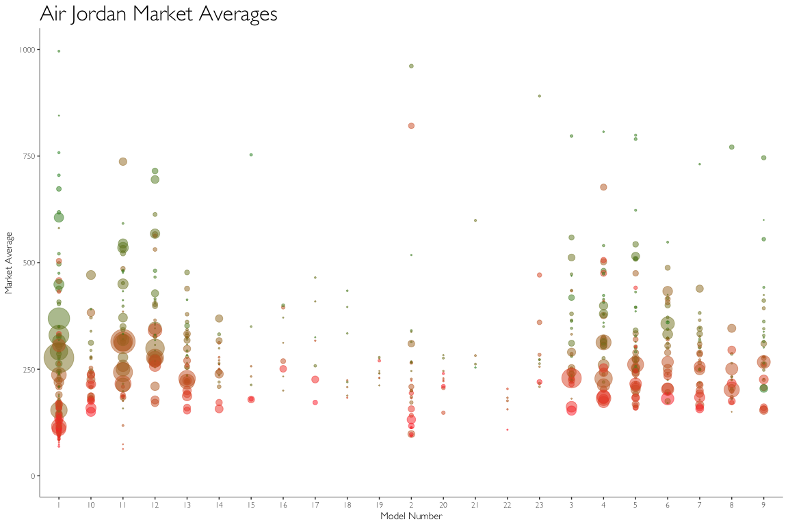
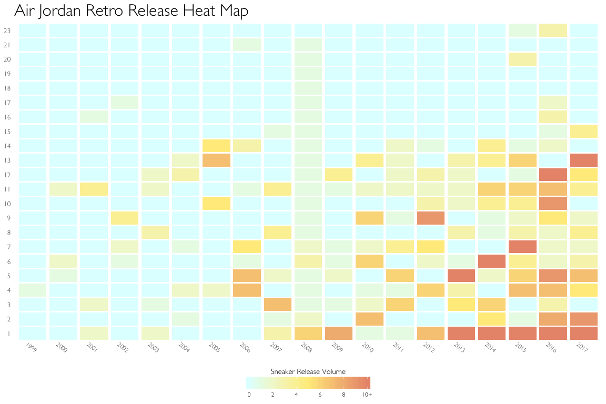

Air Jordan Resell Market
================

Data Cleansing
--------------

``` r
library(tidyverse)
library(stringr)
library(lubridate)
library(reshape2)
library(RColorBrewer)
library(scales)

#Read in data and rename
sneakers <- read.csv("data/shoeDataV2.csv", header = FALSE, stringsAsFactors = FALSE)
colnames(sneakers) <- c('Sneaker', 'Sales', 'Premium', 'MarketAvg', 
                        'ProductID', 'Retail', 'ReleaseDate', 'Colorway', 'MarketRange')

# Regex Cleaning
sneakers <- sneakers[!grepl('GS',sneakers$Sneaker, fixed = TRUE),]
sneakers <- sneakers[grepl('\\$\\d+',sneakers$Retail),]
sneakers$MarketAvg <- gsub('$', '', sneakers$MarketAvg, fixed = TRUE)
sneakers$Premium <- gsub('%', '', sneakers$Premium, fixed = TRUE)
sneakers$Retail <- gsub('$', '', sneakers$Retail, fixed = TRUE)
sneakers$MarketRange <- gsub('$', '', sneakers$MarketRange, fixed = TRUE)
sneakers$MarketRange <- gsub('--', 'NA', sneakers$MarketRange, fixed =TRUE)
sneakers$MarketRange <- gsub(',', '', sneakers$MarketRange, fixed =TRUE)
sneakers$Retail <- gsub(',', '', sneakers$Retail, fixed =TRUE)

# Tidying Up Data
sneakers <- sneakers %>% separate(MarketRange, into = c('MarketLow', 'MarketHigh'), sep = ' - ')
numerics <- c('Sales', 'Premium', 'MarketAvg', 'Retail', 'MarketLow', 'MarketHigh')
sneakers[numerics] <- sapply(sneakers[numerics], as.numeric)

# Date Variables
sneakers$ReleaseDate <- ymd(sneakers$ReleaseDate)
sneakers$Year <- year(sneakers$ReleaseDate)

# Parse Sneaker Names #
sneakers <- sneakers[!grepl('X{2,3}\\d*', sneakers$Sneaker),] #Remove XX4 models and up 
sneakers <- sneakers[grepl('(?<=Jordan\\s)\\d', sneakers$Sneaker, perl = TRUE),] #Only keep Air Jordan 
#(number) models (exclude Spizike's and Fusions)
sneakers$Colorway <- gsub('Jordan\\s\\d+\\s', '', sneakers$Sneaker)
sneakers$RetroOG <- ifelse(grepl('\\d+\\sOG', sneakers$Sneaker), 'OG', 'Retro')
sneakers$ModelNumber <- as.numeric(str_extract(sneakers$Sneaker, '(?<!\\()\\d+(?!\\))'))
sneakers <- sneakers %>% filter(ModelNumber < 2010)

# Data Anamolies and Missing Sneakers Hard Fixes #
sneakers <- mutate(sneakers, RetroOG = ifelse(ModelNumber == 23 & Year == 2008, 'OG', RetroOG))
bred2001 <- c('Jordan 1 Retro Bred (2001)', 54, '', 705, '136066-061', 100, '2001-08-25', 
              'Black/Varsity Red-White', 407, 693, 2001, 'Retro', 1)
royal2001 <- c('Jordan 1 Retro Royal Blue (2001)', 34, '', 758, '136066-041', 100, '2001-10-06', 
               'Black/Royal Blue', 547, 1007, 2001, 'Retro', 1)
sneakers <- rbind(sneakers, bred2001, royal2001)
sneakers[numerics] <- sapply(sneakers[numerics], as.numeric)
```

Data Used in Plots
------------------

This is the final data that will be used to create the data visualizations.

``` r
head(sneakers)
```

    ##                                Sneaker Sales Premium MarketAvg  ProductID
    ## 1               Jordan 3 Retro Crimson   329   -12.5       228 136064-005
    ## 2            Jordan 3 Retro White Flip    43    46.0       253 315767-101
    ## 3         Jordan 7 Retro Premio Bin 23    26   614.3      1243 436206-101
    ## 4 Jordan 18 OG Low Black Silver Chrome     7   -16.7       183 306151-001
    ## 5       Jordan 15 Retro Stealth (2017)   442   -34.2       179 881429-001
    ## 6 Jordan 6 Retro Infrared Black (2014)  1962    83.8       357 384664-023
    ##   Retail ReleaseDate                    Colorway MarketLow MarketHigh Year
    ## 1    160  2013-02-23               Retro Crimson       112        168 2013
    ## 2    150  2007-03-24            Retro White Flip       206        232 2007
    ## 3    175  2010-11-26         Retro Premio Bin 23       947       1553 2010
    ## 4    150  2003-05-31  OG Low Black Silver Chrome        69        181 2003
    ## 5    190  2017-01-07        Retro Stealth (2017)        87        163 2017
    ## 6    185  2014-11-28 Retro Infrared Black (2014)       246        434 2014
    ##   RetroOG ModelNumber
    ## 1   Retro           3
    ## 2   Retro           3
    ## 3   Retro           7
    ## 4      OG          18
    ## 5   Retro          15
    ## 6   Retro           6

To create a heatmap we use the melt() function from the reshape library to create counts by ModelNumber and Year.

``` r
sneakersg3 <- table(filter(sneakers, RetroOG == 'Retro') %>% select(ModelNumber, Year)) %>% melt()
head(sneakersg3)
```

    ##   ModelNumber Year value
    ## 1           1 1999     0
    ## 2          10 1999     0
    ## 3          11 1999     0
    ## 4          12 1999     0
    ## 5          13 1999     0
    ## 6          14 1999     0

Data Visualizations
-------------------

We first examine the overall Air Jordan Resell Market.

``` r
### Plots ###
g <- ggplot(data = sneakers, aes(x = ModelNumber, y = MarketAvg))
g + geom_point(aes(size = Sales, color = rank(Premium)), alpha = 0.5) +
  ggtitle("Air Jordan Market Averages") +
  xlab("Model Number") +
  ylab("Market Average") +
  scale_x_discrete(breaks=seq(0, 23, 1)) +
  scale_colour_gradient(low="firebrick1", high="forestgreen") +
  theme(panel.grid.major = element_blank(), 
        panel.grid.minor = element_blank(), 
        panel.background = element_blank(), 
        plot.title = element_text(size = 24, face = "bold"),
        axis.line = element_line(colour = "darkgrey"), 
        legend.position = "none", 
        text=element_text(family="Gill Sans Light")) +
  scale_size(range = c(0, 15)) +
  ylim(0, 1000)
```

 This bubble chart allows us to see the variation in resell prices by shoe model. Quickly we can that some of the most popular Air Jordan models, namely the I, IV, V, XI, and XII have the largest number of secondary sales.

Next we examine the release patterns of the Air Jordan line.

``` r
g3 <- ggplot() 
g3 + geom_tile(data = sneakersg3, aes(x = factor(Year), y = factor(ModelNumber),
                                      fill = value), width=.9, height=.9) +
     labs(fill='Sneaker Release Volume') +
     ggtitle("Air Jordan Retro Release Heat Map") +
     scale_fill_gradientn(colours=c("lightcyan1","lightgoldenrod1","darksalmon"), 
                          labels=c("0", "2", "4", "6", "8", "10+"),
                          breaks = c(0, 2, 4, 6, 8, 10), limits=c(0, 10), oob=squish) +
     theme_minimal() +
     theme(panel.grid.major = element_blank(),
           panel.grid.minor = element_blank(), 
           plot.title = element_text(size = 24, face = "bold"), 
           axis.title.x=element_blank(),
           axis.text.x = element_text(angle = -40, hjust = .5),
           axis.title.y=element_blank(),
           axis.text.y=element_text(size=10, hjust=1),
           text=element_text(family="Gill Sans Light"),
           legend.position= 'bottom',
           legend.direction = 'horizontal',
           legend.title.align=0.5,
           legend.key.width=unit(1.25,"cm")) +
      guides(fill = guide_colourbar(title.position = "top")) 
```


